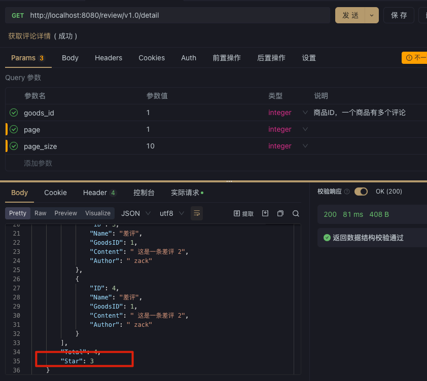
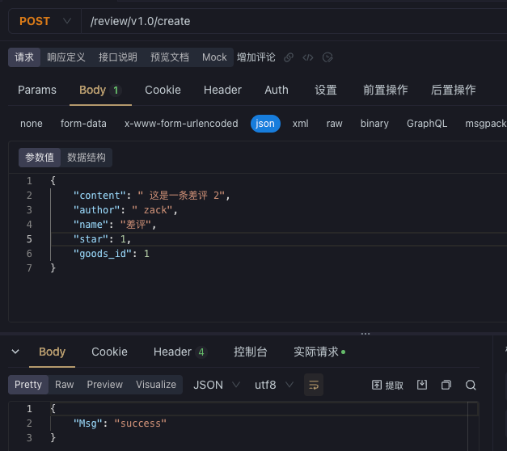

# 项目介绍：

review 是评论项目（http 协议），rating 是打星项目（grpc 协议），两个项目都是基于 go 语言开发的。
review 项目会访问rating 项目，获取商品的评分信息。

## 好评review 项目：

review：对于商品评价好与坏，类似于京东淘宝的好评。用户针对商品写入自己的评价。

## 打星rating 项目
商品满分 5 星：

- 非常满意：5 分
- 满意：4 分
- 一般：3 分
- 不满意：2 分
- 非常不满意：1 分

# 部署：

*部署说明*：
首先要开启网格集群，然后在网格集群上部署应用。

csp 界面部署可以可以使用应用管理+流量治理功能。

使用命令行部署可以使用治理功能。

1. 界面的镜像部署，镜像地址：
    - rating 项目：zackzhangkai/ratings-kitex:latest
    - review 项目：zackzhangkai/reviews-hz:latest

然后在csp 界面创建两个应用并部署到对应的集群上。

2. 在开启过网格的k8s集群上使用命令行安装：
    ```shell
    helm -n review upgrade --install review ./review-rating-chart --create-namespace
    ```

# 请求：

## 创建：

## 请求：



